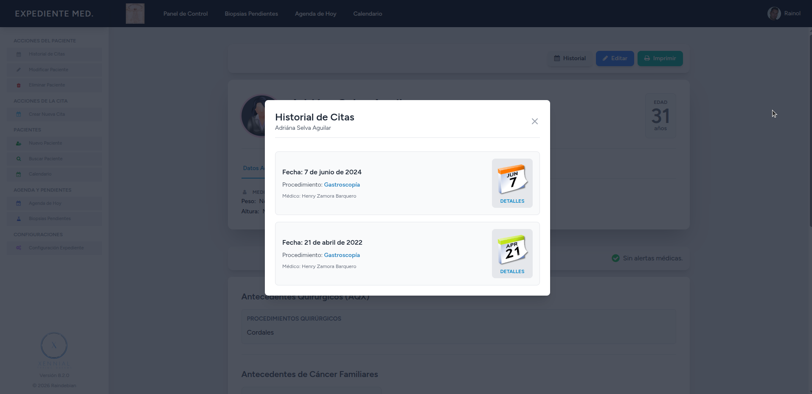
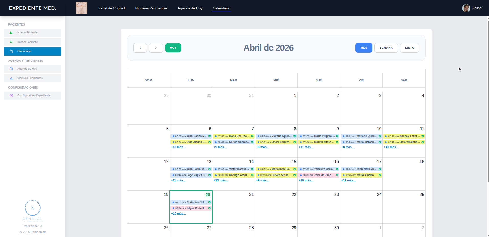
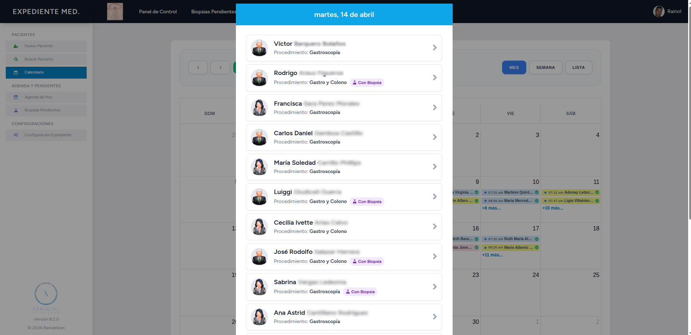
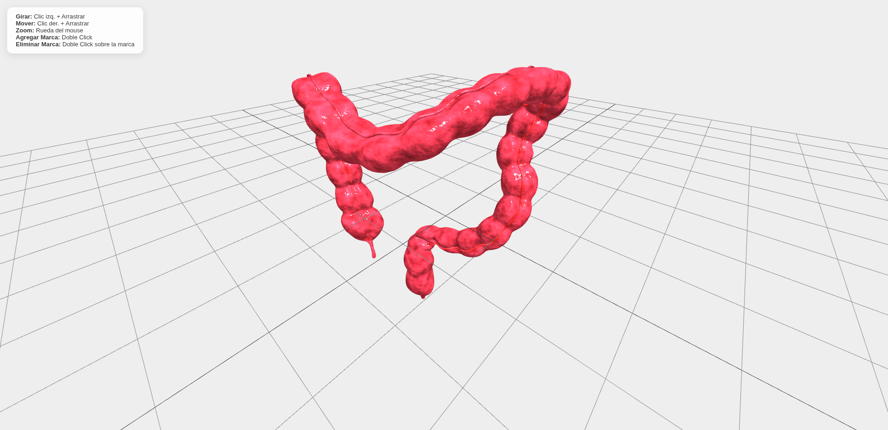
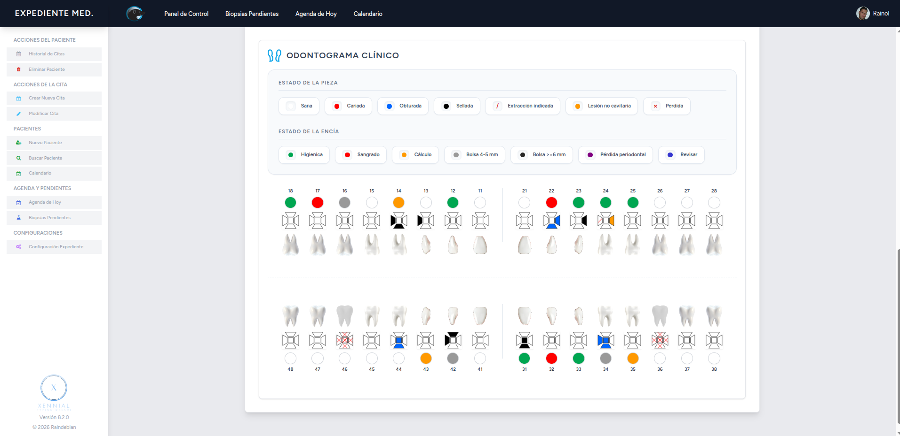
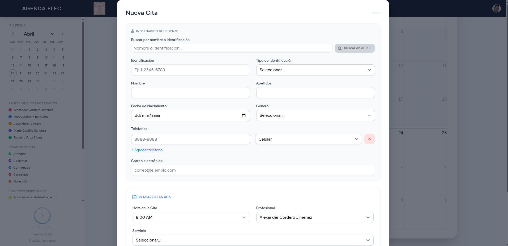
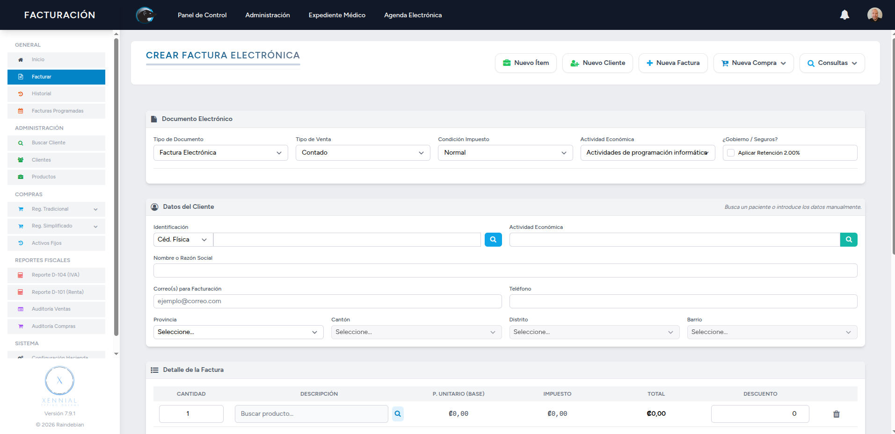
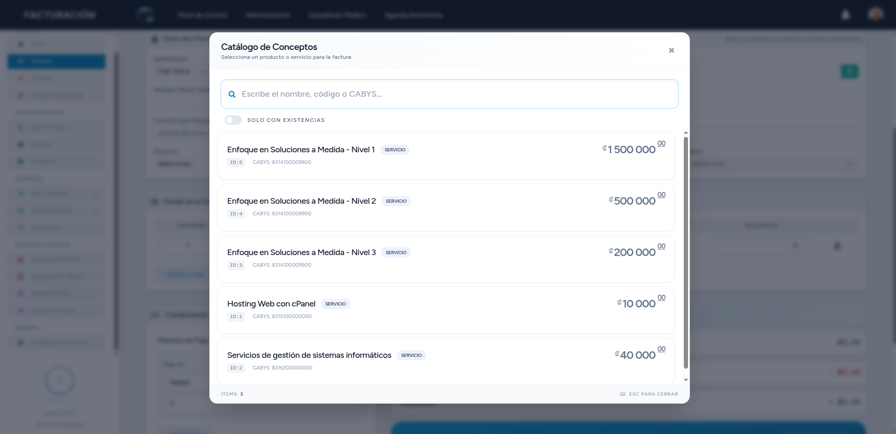
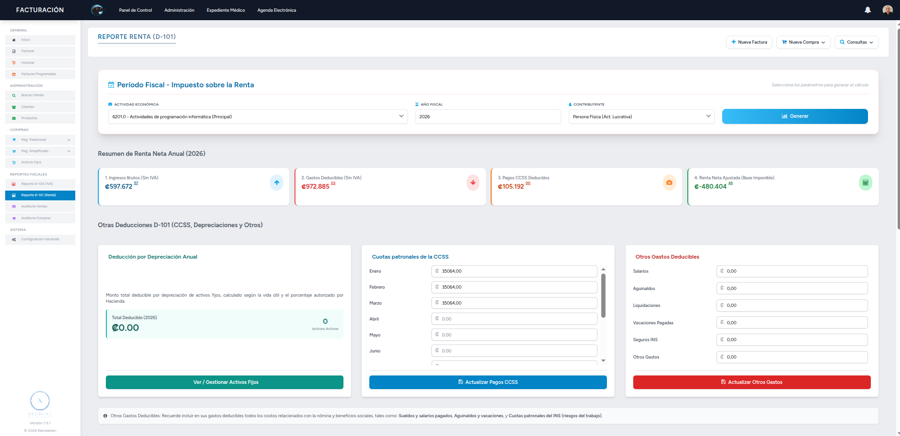

# 🏥 Xennial — Sistema Integral de Gestión Clínica

## 🚀 Descripción
**Xennial** es una plataforma web orientada a clínicas y consultorios médicos que centraliza la gestión de pacientes, agenda médica y facturación electrónica en un solo sistema.

Diseñado para entornos reales de producción, el sistema separa claramente las operaciones clínicas de las administrativas, garantizando integridad de datos, trazabilidad y eficiencia operativa.

---

## 🧠 Problema que resuelve
En muchos centros médicos, la información se encuentra fragmentada entre múltiples herramientas o procesos manuales, lo que genera:

- Pérdida de información clínica
- Errores en facturación
- Dificultad en seguimiento de pacientes
- Procesos administrativos ineficientes

**Xennial** unifica estos procesos en una sola plataforma, mejorando la productividad y reduciendo errores humanos.

---

## ⚙️ Módulos Principales

### 🩺 Expediente Médico
- Gestión completa de pacientes
- Historial clínico estructurado
- Registro de signos vitales y antecedentes
- Manejo de documentos médicos (PDFs en nube/local)
- Visualización 3D interactiva de órganos con anotaciones
- Odontograma digital tipo EDUS
- Asociación automática de resultados de Biopsias en citas médicas
- Integración de reportes médicos. 
- Generación de información gráfica y estadística de pacientes para la planificación de servicios. 

### 📅 Agenda Electrónica
- Calendario interactivo con múltiples vistas
- Gestión de citas médicas
- Control de disponibilidad en tiempo real
- Prevención de conflictos de agenda (overbooking)
- Gestión de profesionales y servicios

### 💳 Facturación Electrónica
- Generación de comprobantes electrónicos
- Integración con sistemas fiscales
- Manejo de múltiples tipos de documentos
- Cálculo automático de impuestos y descuentos
- Control de pagos (efectivo, tarjeta, transferencias)
- Módulo de control y gestión de activos fijos con cálculo de depreciación
- Procesamiento automático de correos electrónicos de compras para extracción y registro de información
- Generación de reportes fiscales (IVA y renta) y exportación de información contable en formatos compatibles (Excel) para uso contable
- Módulo de gestión de alertas automáticas para el monitoreo de procesos incompletos, pendientes o fallidos

---

## 🤖 Integración de Inteligencia Artificial

### Asistente de Clasificación Médica
- Procesamiento de lenguaje natural para identificar síntomas
- Clasificación automática de descripciones clínicas
- Sistema de reintentos mediante colas si el servicio no responde
- Registro de resultados para auditoría y mejora continua

---

## 🧩 Arquitectura del Sistema

El sistema está diseñado bajo principios de:

- Separación por capas (servicios, controladores, modelos)
- Encapsulación de lógica de negocio
- Uso de transacciones para operaciones críticas
- Procesamiento asíncrono mediante colas
- Integración con servicios externos mediante APIs

---

## 🛠️ Stack Tecnológico

- **Backend:** Laravel (PHP)
- **Frontend:** Blade, Tailwind CSS, Alpine.js
- **Componentes reactivos:** Livewire
- **Base de datos:** MySQL / MariaDB
- **Build Tools:** Vite

### Librerías destacadas
- spatie/laravel-permission
- spatie/laravel-activitylog
- filament/filament
- maatwebsite/excel
- dompdf/dompdf
- openai-php/client

---

## 🧠 Retos técnicos abordados

- Consistencia entre datos clínicos y financieros
- Integración con APIs externas (MdH, BCCR, Registro Civil)
- Manejo de procesos asíncronos y reintentos
- Optimización de consultas SQL complejas
- Diseño modular y escalable

---

## 💾 Infraestructura y rendimiento

El sistema está preparado para entornos de producción con:

- Manejo de colas para procesos en segundo plano
- Uso de caché y sesiones optimizadas
- Automatización de tareas programadas
- Almacenamiento de archivos en la nube
- Estrategia de respaldos automatizados

> La configuración detallada de infraestructura y despliegue se mantiene privada.

---

## 📸 Capturas del sistema

### 🧭 Dashboard

---

### 🩺 Expediente Médico

---

### 📅 Agenda Electrónica

---

### 💳 Facturación Electrónica

---

## 🔒 Código fuente

Este repositorio es únicamente demostrativo y no contiene el código fuente completo.

> El acceso al código está restringido debido a que el sistema maneja lógica de negocio sensible y procesos clínicos/financieros.

---

## 📬 Contacto

Si deseas conocer más sobre el proyecto o solicitar una demostración técnica:

- LinkedIn: *https://www.linkedin.com/in/rainol-azofeifa-37736028a/*
- Email: *info@raindebian.net*

---

## ⭐ Notas finales

Este proyecto representa un sistema real en producción con múltiples módulos integrados, enfocado en resolver necesidades críticas del sector salud mediante tecnología moderna y arquitectura escalable.
